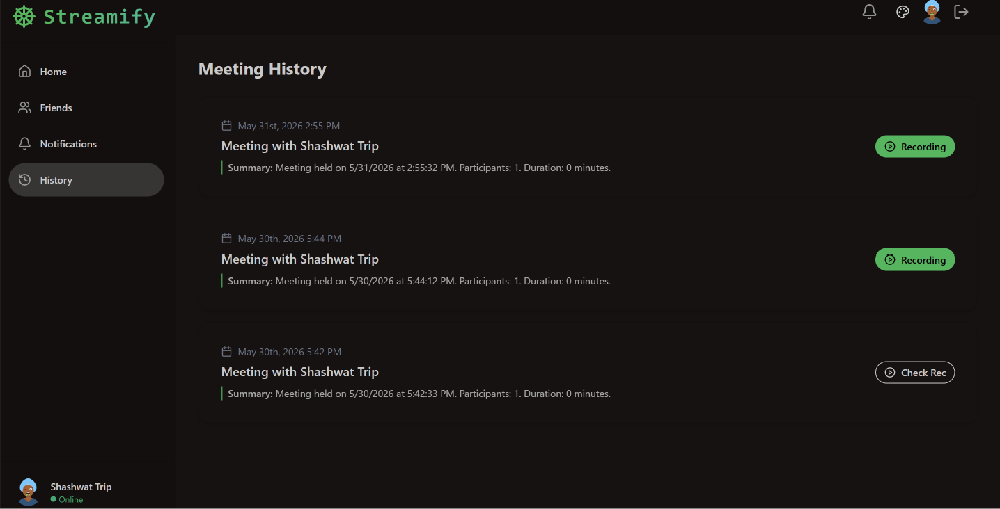
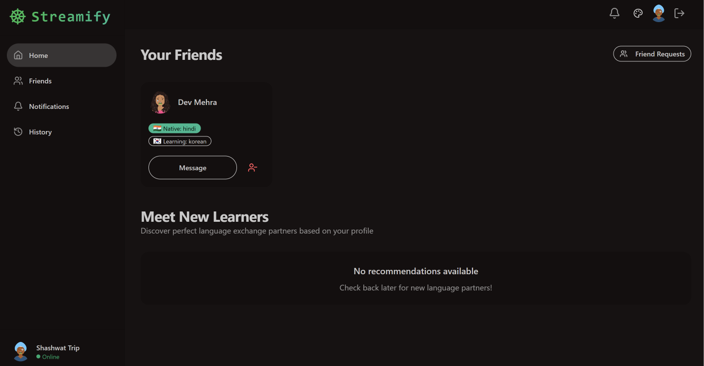
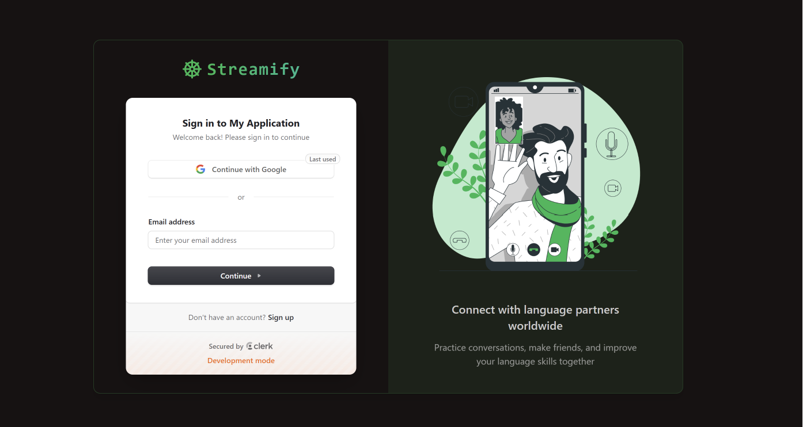
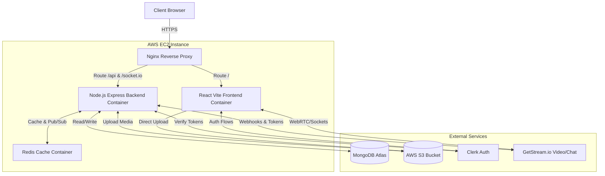

# Streamify - Real-Time Chat & Video Calling App

Streamify is a full-stack, modern, and highly scalable communication platform built to seamlessly handle real-time messaging, video calls, and user networking. 

**🔴 Live Demo: [https://streamify-chat.duckdns.org/](https://streamify-chat.duckdns.org/)**

It provides an end-to-end communication suite similar to Discord or Zoom, complete with friend requests, global presence tracking, robust authentication, and meeting recordings.


---

## 📸 Screenshots

<p align="center">
  
</p>

<p align="center">
  
</p>

<p align="center">
  
</p>

---

* **Real-time Global Chat**: Powered by WebSockets (Socket.io) for instant messaging and real-time online/offline presence tracking.
* **1-on-1 & Group Video Calls**: High-quality video conferencing powered by [GetStream.io](https://getstream.io/), complete with screen sharing and mute controls.
* **Meeting Recordings & History**: Automatically records video calls and saves meeting summaries and historical data for users to review later.
* **Robust Authentication**: Fully integrated with [Clerk](https://clerk.com/) for secure Google OAuth, email verification, and session management.
* **Social Networking**: Send, receive, and manage friend requests. Build your own network of contacts.
* **Beautiful, Customizable UI**: Designed with **TailwindCSS** and **DaisyUI**. Users can customize their experience by choosing from over 32 vibrant and dynamic themes!
* **Responsive Design**: Flawless experience on both desktop and mobile devices.

---

## 🛠️ Tech Stack

**Frontend**
* **React 19** + **Vite** (Lightning fast SPA)
* **TailwindCSS** + **DaisyUI** (Styling & Themeing)
* **Zustand** + **TanStack React Query** (State management & Data fetching)
* **Clerk React SDK** (Authentication)
* **GetStream Video React** (Video Call UI & Logic)
* **Socket.io-client** (Real-time events)

**Backend**
* **Node.js** + **Express.js** (REST API)
* **MongoDB** + **Mongoose** (Database)
* **Socket.io** (WebSocket Server)
* **Clerk Node SDK** (Authentication Middleware)
* **GetStream Node SDK** (Token generation & Webhooks)

---

## 🚀 Quick Start (Local Development)

### 1. Prerequisites
Make sure you have Node.js installed, as well as accounts for [MongoDB](https://www.mongodb.com/), [Clerk](https://clerk.com/), and [GetStream.io](https://getstream.io/).

### 2. Clone the repository
```bash
git clone https://github.com/shashwat0010/streamify_chat_app.git
cd streamify_chat_app
```

### 3. Setup the Backend
Open a terminal and navigate to the backend folder:
```bash
cd backend
npm install
```
Create a `.env` file in the `backend` directory and add your credentials:
```env
MONGO_URI=your_mongodb_connection_string
PORT=5001
NODE_ENV=development
CLIENT_URL=http://localhost:5173

# Clerk Keys
CLERK_SECRET_KEY=your_clerk_secret_key
CLERK_PUBLISHABLE_KEY=your_clerk_publishable_key

# GetStream Keys
STREAM_API_KEY=your_stream_api_key
STREAM_API_SECRET=your_stream_api_secret
```
Run the backend server:
```bash
npm run dev
```

### 4. Setup the Frontend
Open a new terminal and navigate to the frontend folder:
```bash
cd frontend
npm install
```
Create a `.env` file in the `frontend` directory:
```env
VITE_BACKEND_URL=http://localhost:5001
VITE_STREAM_API_KEY=your_stream_api_key
VITE_CLERK_PUBLISHABLE_KEY=your_clerk_publishable_key
```
Run the frontend development server:
```bash
npm run dev
```

Visit `http://localhost:5173` in your browser!

---

## 🏛️ Architecture



---

## 🌍 Deployment (AWS EC2 & Docker)

This project uses a fully automated CI/CD pipeline with GitHub Actions.

1. **GitHub Actions**: On every push to the `main` branch, the pipeline builds the Docker images.
2. **AWS EC2**: The pipeline SSHs into the EC2 instance and triggers `docker-compose up --build -d` to spin up the latest containers.
3. **Nginx & Let's Encrypt**: An Nginx container routes traffic and serves SSL certificates.

### Required Secrets for CI/CD
To deploy this project to your own EC2 instance, configure the following GitHub Secrets:
* `AWS_ACCESS_KEY_ID`, `AWS_SECRET_ACCESS_KEY`, `AWS_REGION`, `AWS_S3_BUCKET_NAME`
* `CLERK_SECRET_KEY`, `CLERK_PUBLISHABLE_KEY`, `VITE_CLERK_PUBLISHABLE_KEY`
* `STREAM_API_KEY`, `STREAM_API_SECRET`, `VITE_STREAM_API_KEY`
* `MONGO_URI`, `JWT_SECRET_KEY`
* `EC2_HOST`, `EC2_SSH_KEY`

---

## 📜 License
This project is licensed under the MIT License.
